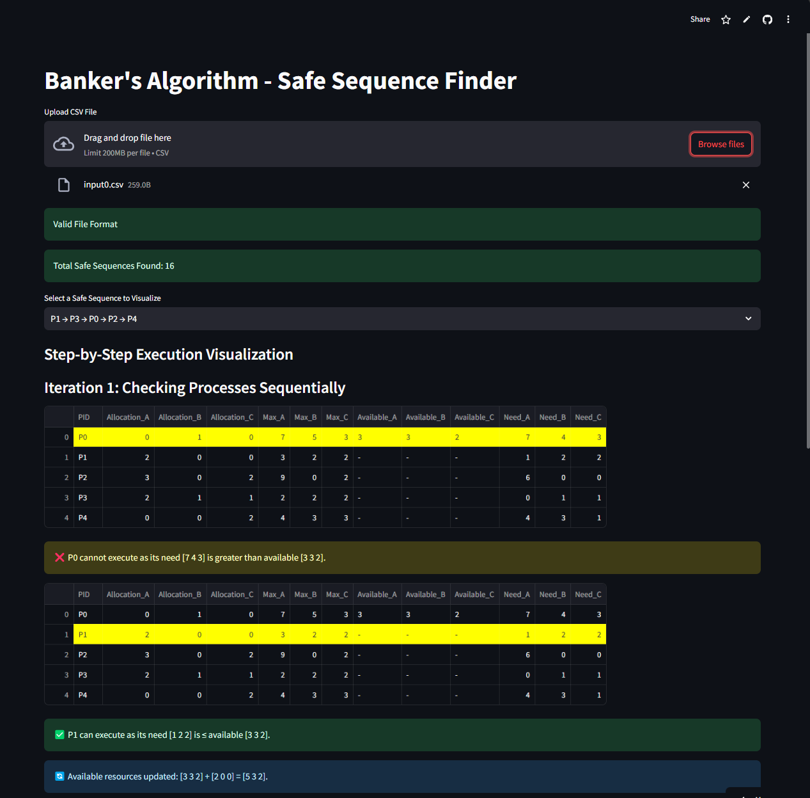
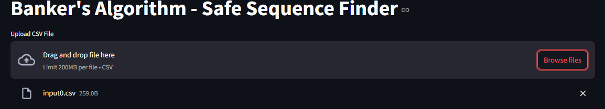
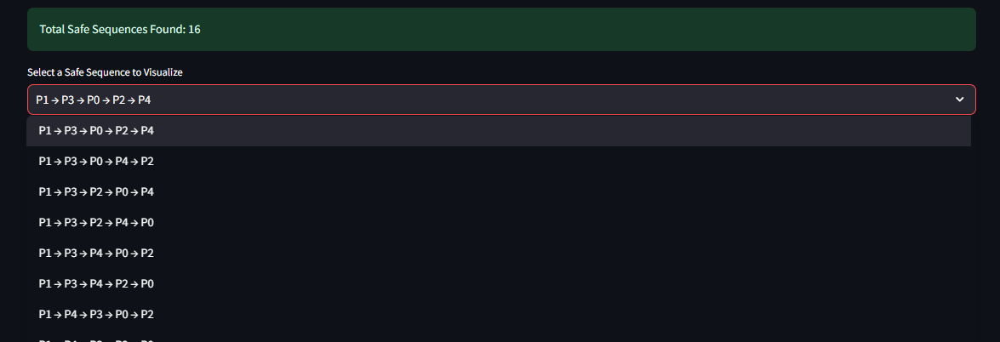
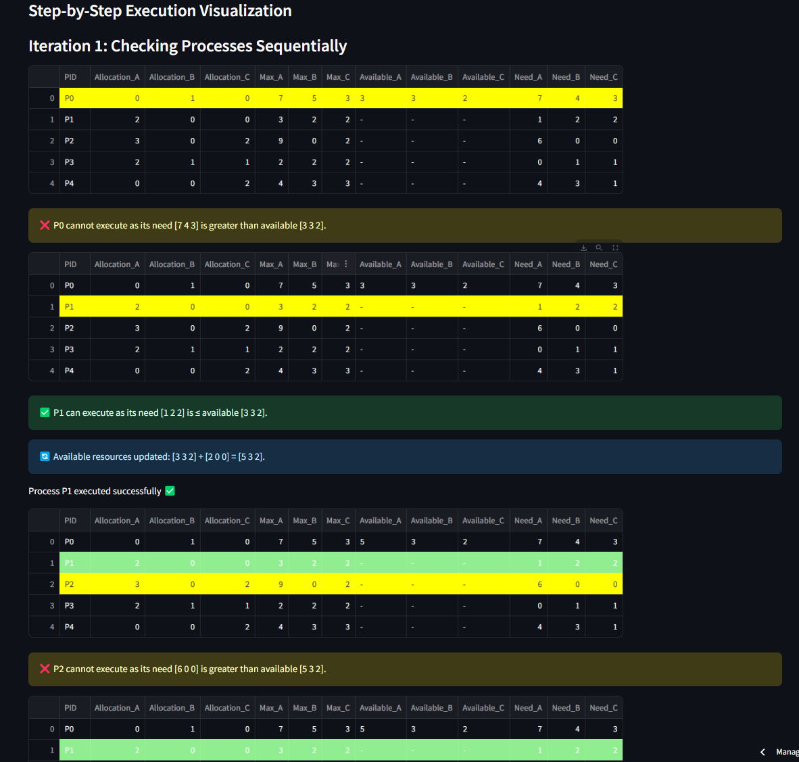

# Banker's Algorithm Visualizer - Detailed Report & README

## Project Overview
The **Banker's Algorithm Visualizer** is a web application that helps users analyze and understand the Banker's Algorithm for deadlock avoidance. This tool takes a CSV file as input, processes allocation and resource data, and visually demonstrates step-by-step execution of safe sequences. The application ensures users can track resource allocation and determine whether the system is in a safe or unsafe state.

**Live Demo:** [Banker's Algorithm Visualizer](https://sakibahmedshanto-bankersalgorithm.streamlit.app/)

## Features
- **CSV File Upload:** Users can upload a CSV file with allocation, maximum need, and available resource data.
- **Safe Sequence Finder:** The app computes all possible safe sequences.
- **Step-by-Step Execution:** Users can visualize the execution process with clear explanations.
- **Dynamic Resource Tracking:** Shows real-time resource updates at each execution step.
- **Interactive Navigation:** Floating "Next" and "Back" buttons allow seamless step-by-step iteration.
- **Process Highlighting:** Highlights executing and completed processes in the table.
- **Error Handling:** Detects invalid file formats and unsafe states.

## Technologies Used
- **Python**: Core logic implementation
- **Streamlit**: Web framework for interactive UI
- **Pandas**: Data manipulation and processing
- **NumPy**: Numerical operations for resource tracking

---

## Usage Guide
### 1. Upload CSV File

- Click on the **"Upload CSV File"** button.
- Ensure the file follows the correct format.

### 2. Select a Safe Sequence

- If safe sequences exist, choose one from the dropdown.

### 3. Step Through Execution

- Click **Next** to execute processes sequentially.
- Watch available resources update dynamically.
- Completed processes turn **green**, and active ones highlight **yellow**.

### 4. Completion
- If all processes execute safely, you’ll see a success message.

---

## CSV File Format
| PID  | Allocation_A | Allocation_B | Allocation_C | Max_A | Max_B | Max_C | Available_A | Available_B | Available_C | Need_A | Need_B | Need_C |
|------|-------------|-------------|-------------|-------|-------|-------|------------|------------|------------|-------|-------|-------|
| P0   | 0           | 1           | 0           | 7     | 5     | 3     | 3          | 3          | 2          | 7     | 4     | 3     |
| P1   | 2           | 0           | 0           | 3     | 2     | 2     |            |            |            | 1     | 2     | 2     |
| P2   | 3           | 0           | 2           | 9     | 0     | 2     |            |            |            | 6     | 0     | 0     |

> **Ensure the first row contains available resources.**

---

## Error Handling
- **Invalid File Format:** Displays an error if the CSV does not match the expected format.
- **No Safe Sequence:** If the system is in an unsafe state, an alert appears.
- **Step Navigation Issues:** If a user reaches the last step, navigation resets.

---

## Future Improvements
- Support for multiple resource types.
- Improved UI with animations.
- Detailed analytics on execution statistics.
- Export reports on safe sequences.

---

## Author
Developed by **Sakib Ahmed Shanto** 🚀

**Live App:** [Banker's Algorithm Visualizer](https://sakibahmedshanto-bankersalgorithm.streamlit.app/)
